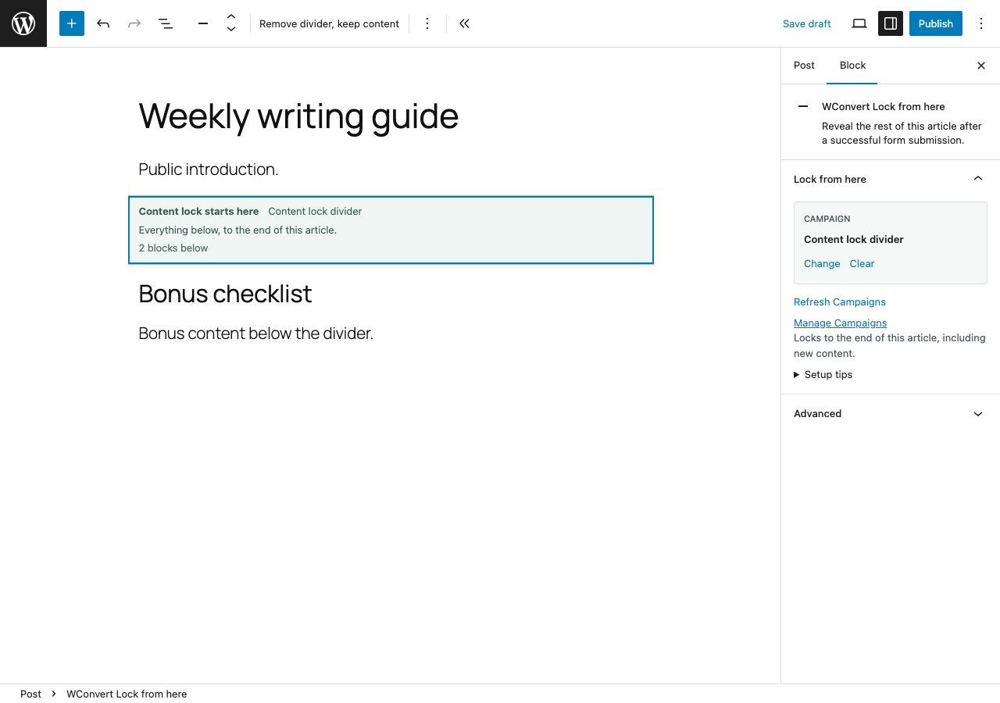
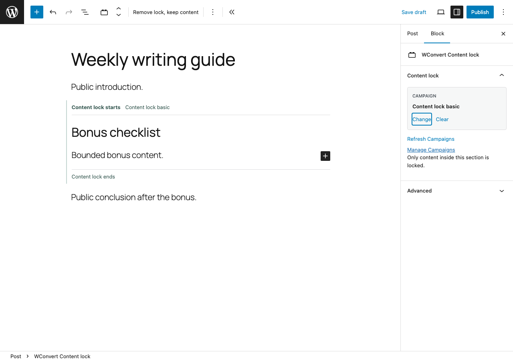

# Set up Content lock

Content lock reveals part of a public post or page after a visitor submits a
WConvert form. Use it for an article bonus, checklist, download instructions or
another promotional extra.

First, prepare the Campaign:

1. In **WConvert > Campaigns**, create or edit an inline Campaign.
2. Open **Display rules > Placement** and choose **Content lock**.
3. Finish the form and its success screen, then publish the Campaign.

The Campaign must be published before an author can select it in the WordPress
editor.

## Choose the right block

### Lock from here

Use **WConvert Lock from here** for the usual article workflow. Put the marker
after the public introduction. It locks the rest of the article, including content
you add later. All blocks below it must use the supported content listed below.
Your site's footer and comments stay outside the lock.

Write the article as usual with top-level WordPress blocks. Move the marker to
change where the locked part begins. Removing the marker leaves the article
blocks in place.

### Content lock

Use **WConvert Content lock** when only one bounded section should be revealed.
This works well for a bonus followed by a public conclusion. Add the block, then
write or move the bonus content inside it. Content after the section stays
public.

You can also select supported existing blocks and use **Transform to > WConvert
Content lock**. **Remove lock, keep content** removes the section boundary while
preserving its contents.

## Select the Campaign

Select either WConvert block, then use **Campaign** in the block settings sidebar.
If the sidebar is closed, choose **Choose Campaign** in the block or open the
Settings sidebar. Select the published Content lock Campaign by name, then update
or publish the post.

Use one lock on a post or page. An earlier ordinary WConvert form takes precedence
over a later lock for the same Campaign.

## Test the published page

WordPress previews intentionally leave the content readable. Use a local-only
test Campaign with no live delivery, then open the published page in a private
browser window and confirm that the public introduction is visible. Submit the
form, select **Continue to content**, then reload the page.

The same browser remembers access to that Campaign for 30 days. It does
not recognize the visitor on another browser or device, and it does not check an
email subscription or customer account.

Content lock is promotional gating. The page HTML and direct file URLs remain
public. Do not use it for private files, paid membership, age checks or other
access control.

## Supported content and readable fallback

Use paragraphs, headings, static images, lists, quotes, tables, buttons and links.
Keep forms, audio, video, embeds, shortcodes and other scripted content outside
the locked region. Groups, Columns, synced patterns and third-party blocks are
not supported.

WConvert leaves content readable when it cannot safely run the form or identify a
supported region. This includes missing JavaScript, unavailable or disabled Pro,
an unpublished Campaign, an unsupported block, duplicate locks and technical
submission failures. A validation error keeps the form open so the visitor can
correct it.

Targeting, schedules, display rules and frequency limits still apply. They can
legitimately leave the content public for a visitor who should not see the form.

If a Campaign is missing from the sidebar, confirm that it is published, set to
Content lock and available now, then use **Refresh Campaigns**. If a published
page stays readable unexpectedly, check for an earlier WConvert form, a second
lock or unsupported content. Clear page and CDN caches after changing the
Campaign or plugin state. Test again in a new private window so an existing
30-day browser receipt does not hide the form.
