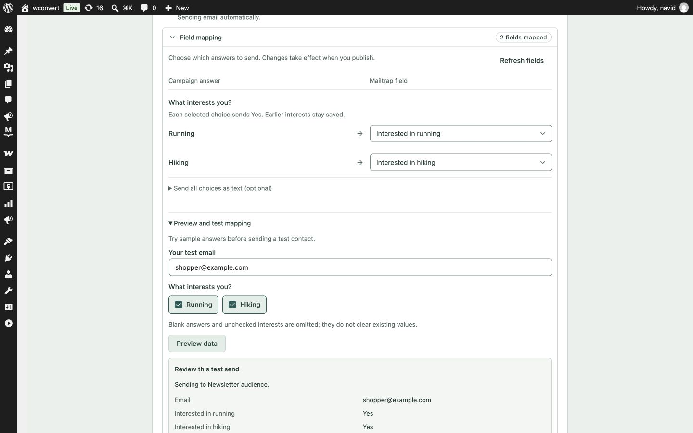
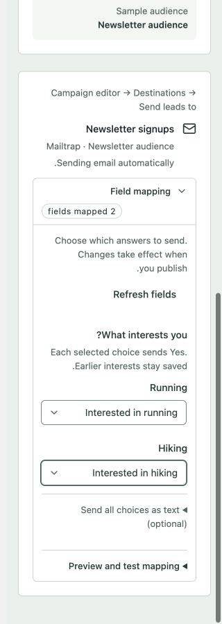

# Interest mapping UI refinement

The 2026-10-07 refinement follows the authored
[admin design guidelines](../../../tools/design-system/GUIDELINES.md), especially
control scope, type roles, quiet copy, shared data states, logical layout and
editor disclosures. The additive interest-delivery behavior is unchanged.

- A question appears once, followed by short Running/Hiking mapping rows.
- Whole-answer text mapping lives in an optional disclosure; existing whole-answer
  mappings remain visible. The summary counts mapped fields without implying
  that every optional representation needs mapping.
- Sample interests use shared checkbox controls and full clickable labels.
- Missing yes/no fields show setup guidance beside the choices.
- Keep-existing mode offers the shared Destination settings dialog from either
  signup's mapping controls, preserving the shared-settings warning and focus return.
- Loading uses RegionSkeleton. Initial failures use RegionErrorState; failed
  refreshes use RegionError, keep previous mappings visible, and require a
  successful retry before preview/test becomes available again.

## Verification

12 integration UI tests, TypeScript typecheck, ESLint on changed TypeScript files,
and Free/Pro admin builds passed. Builds retain the existing chunk-size and
mixed-import warnings. Tests cover compatible fields, optional text disclosure,
sample projection, stale/missing targets, failure recovery and empty boolean
metadata.

Browser checks used the actual React component compiled into an offline fixture
mounted temporarily inside WordPress admin, so WordPress's control styles were
present. The mock adapter made no provider requests and refused test sends.
The temporary admin page and generated review assets were removed afterward.

Observed populated controls at 1440px, 360px and 320px RTL. No document horizontal
overflow at the measured 360px and 320px widths. Native field controls computed
to 36px high / 14px text on desktop. Checkbox labels were about 37px high; keyboard
Space toggled the choice and the focused label had a solid outline. The narrow
check found cramped help text beside Refresh; adding a wrapping basis corrected it.
Missing boolean fields, initial failure and Retry, failed refresh with retained
disabled controls, and loading skeletons were also exercised in WordPress.

The 320px check verifies component reflow, not a change to the full builder's
782px supported floor. The RTL fixture used English strings; translated long
labels and a real coarse-pointer device were not verified in this pass.
This was UI verification, not another live Mailtrap delivery test. No Mailtrap
credentials, contacts, fields, lists or other project settings were accessed.

