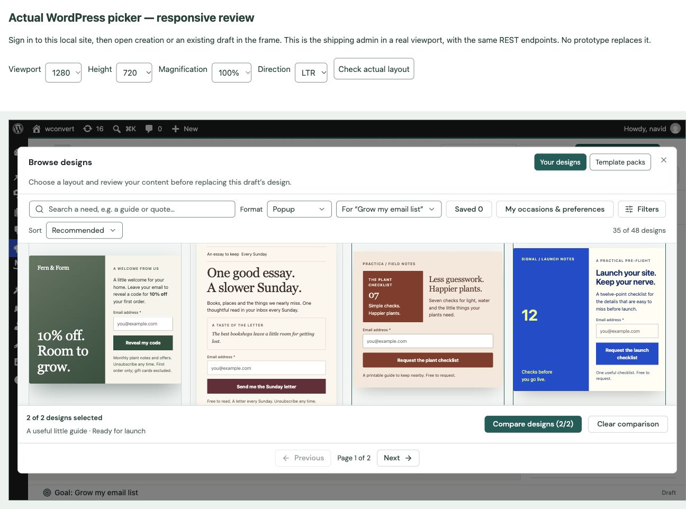
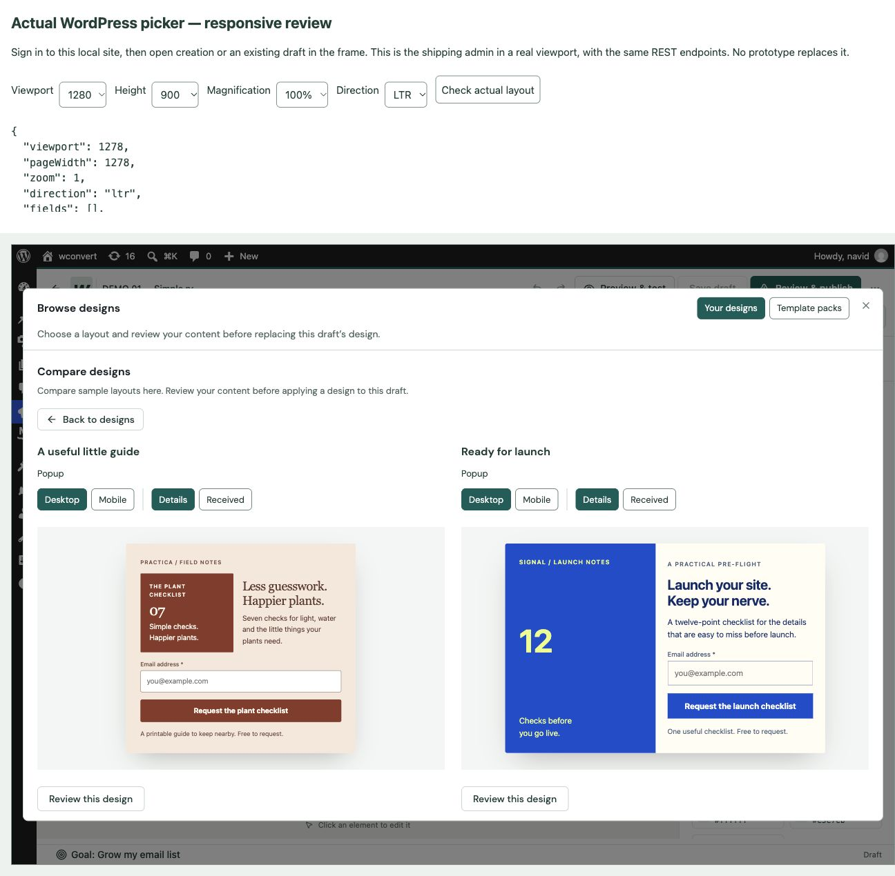
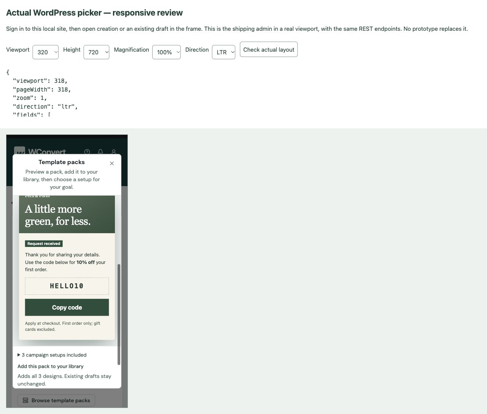

# Picker controls and scroll repair — 2026-09-30

## Problem and repair

Actual WordPress inspection reproduced an unconstrained wrapper inside the
editor modal. The modal was 990px high but contained 2,619px of content; the
gallery body did not scroll, and pagination was below the modal. The library
now has a complete constrained flex chain. Only the gallery body scrolls;
selection and pagination stay outside it. Pack pages share the same pagination
component outside their scrolling list.

The prototype's selection treatment is now shared between creation and editing:
one native Compare checkbox, a two-design limit, selected card edges, and a
tray naming the selected designs with Compare and Clear actions. The tray stays
visible while scrolling creation. It remains recoverable even when a search
hides all selected designs. Region edges use clipping rather than a hidden
overflow container that prevents viewport sticky positioning.

Native option-strip inputs remain keyboard-operable but are visually clipped.
Selected chips are solid petrol with white text; WordPress pseudo dots are
removed. Portal content-choice radios inherit the same petrol dot and ring as
the admin. Search, selects and toolbar buttons use 32px at fine-pointer density,
with a 44px coarse-pointer floor. Phone search preserves its 16px font without
growing above adjacent controls. Device/screen groups have gaps; more than four
screens use a labeled select. Back controls use an outline and directional arrow.

Comparison uses open columns and two 352px-high preview stages fitted in both
dimensions. Individual inspection retains the larger frame and exact content
preparation. Collection/setup dialogs scroll as one document; their actions
have an explicit wrapping gap. Narrow/short pack inspection also scrolls as
one document, preventing stacked tools from squeezing previews over the footer.

## Actual WordPress verification

Authenticated http://wconvert.local/wp-admin/admin.php?page=wconvert. The review
harness embeds the actual admin, not a prototype, using its normal assets and
REST endpoints. No pack was installed and no Campaign was applied, created,
saved or published during this repair review.

- Editor: DEMO 01 → Theme & layout → Browse designs and formats. Native Compare
  choices select the guide and launch designs, disable a third, clear, and lead
  to exact keep/sample preparation. Back returns through comparison to browsing.
  Keyboard arrows switch Desktop/Mobile; Details/Received changes actual screens.
- At 1278 × 718 content pixels, the final modal has 615px client/scroll height.
  Gallery client height is 305px with 2,291px scroll height. Pagination ends at
  y=666.74 inside the modal bottom y=667.74. Search, select and toolbar actions
  measure 32px. Page 2 returns to Page 1 of 1 when filtered to Fieldwork.
- Final comparison frames measure 352px client and scroll height in both
  columns. At 732px and 354px modal widths, editor browsing has equal client and
  scroll widths, a 32px search field and a positive scrolling gallery height.
- Creation: email goal → native Compare choices → comparison → setup inspection.
  Received/Mobile and Back were checked without creating a draft. The creation
  selection tray sits at y=650 with 68px height in a 718px-high viewport.
- Collection: readers collection → real cards, compact format chips and search,
  all-screen inspection/Back. Phone layouts at 318/388 content widths scroll
  vertically without horizontal overflow. RTL and 200% CSS magnification were
  checked; this is not native browser zoom or an assistive-technology certification.
- Packs: Store collection 1.4.1 → Fieldwork → Mobile/Received → Back to designs
  → All packs. At desktop short height, list pagination remains above the footer.
  At 284px narrow content width, inspection has a 506px scrolling viewport and
  951px document. The footer begins exactly where the preview ends, and the
  install action is reachable below it. Native pack search measures 32px.
- Preferences: narrow layout, personal/site ownership sections, and Back to the
  retained editor search were inspected without changing stored preferences.

## Automated checks and evidence

Full JavaScript run: 193 files, 3,491 tests passed with two workers. Final affected
gallery/creation/pack/content-review/stylesheet run: 664 tests passed, including
the added empty-search comparison recovery case. TypeScript and ESLint passed.
Free/Pro admin builds and Free/Basic/Pro/Elite artifact contracts passed after
the final changes. Collection publication validation passed during artifact builds.
CI and real message delivery remain intentionally skipped.

This repairs shared picker UI and interaction boundaries. Remote catalog
hosting, entitlement, licensing, template expansion and the broader programme
remain as recorded in the plan audit; no new template approvals are implied.
