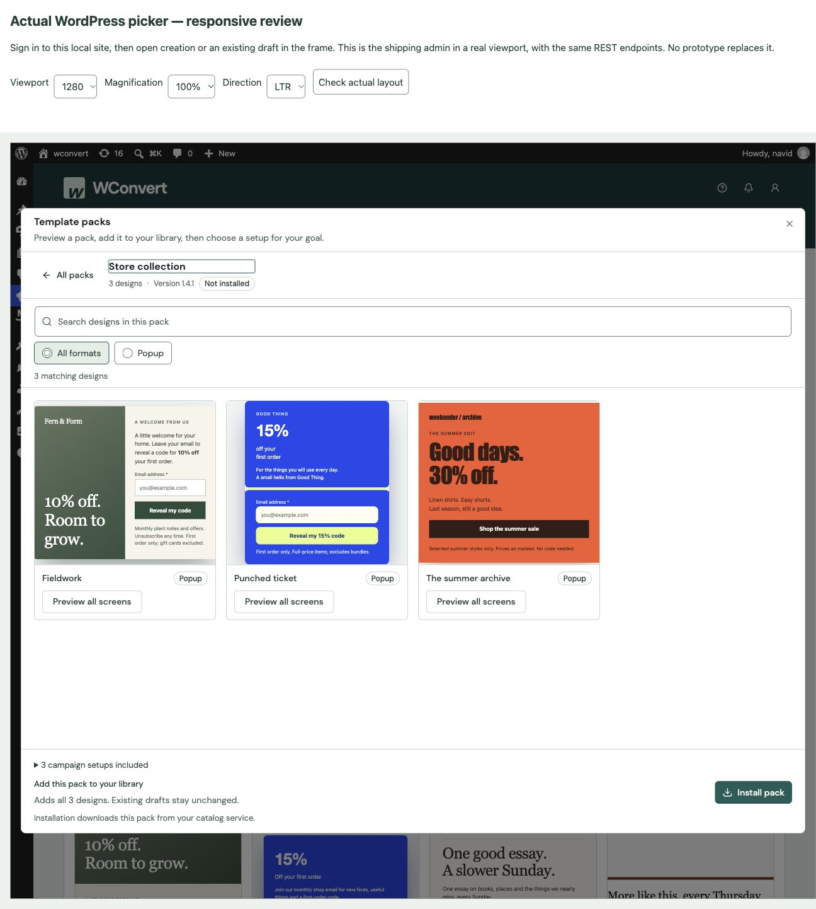
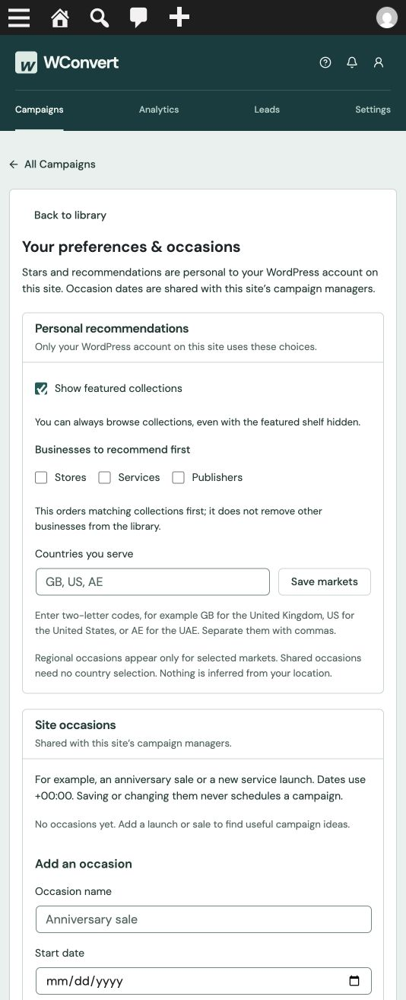
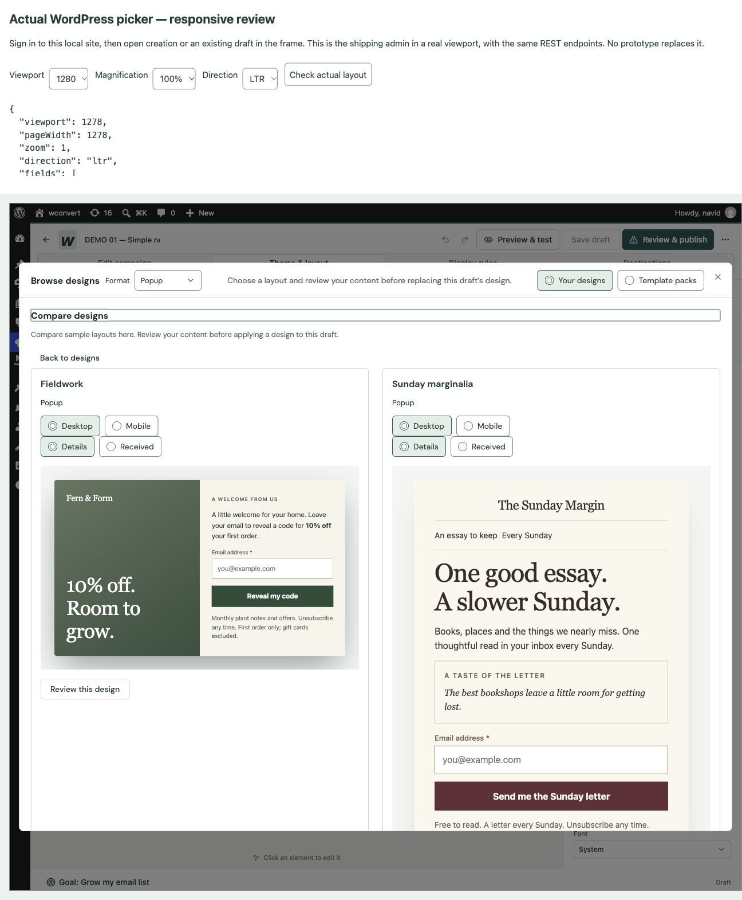

# Shared picker surfaces — 2026-09-30

## Delivered

The pack browser, campaign setup inspector and editor picker share search,
actual design cards, native device/screen choices and one fitted renderer frame.
Pack contents have search, format filtering and pagination, then an explicit
all-screen inspector. Pack search, availability and sorting survive All packs.
Editor comparison stays in the existing dialog and leads to exact prepared
keep/sample content review. Application, baseline/refusal rules and Undo remain
the authoritative editor flow. Preferences use Region headers/bodies, standard
form controls and a clear separation of personal recommendations from shared
site planning dates. Editor preferences Back retains search, scroll and focus.
No new storage, publication or scheduling path was added.

## Local verification

Authenticated actual WordPress at http://wconvert.local/wp-admin/admin.php?page=wconvert.
The existing sample catalog was stale at version 1.1.0; rebuilding with the
validated catalog builder and explicitly refreshing the catalog produced the
current 1.4.1 packs. No packs were installed and no draft was applied, saved or
published on this user site during review.

- Creation: email goal → packs → Store collection real cards → Fieldwork
  Details/Received; Desktop/Mobile. Back navigation remains within the dialog.
- Editor: existing DEMO 01 draft → Theme & layout → Browse designs and formats.
  Search “fieldwork” → preferences → Back retained that value and returned focus
  to the 48px preferences button; search was also 48px. Two-design comparison
  opened exact Fieldwork content review; keep and sample modes prepared, Mobile
  and Received were inspected, and Back returned to comparison. Switching to
  Template packs displayed the same browser with editor-specific purpose text.
- Same-origin actual-admin review frame: 320/390/768/1280 outer widths (318/388/
  766/1278 content widths), RTL and 200% CSS magnification. New pack/dialog
  controls had no horizontal overflow; RTL page rounding was one pixel. Desktop
  dialog content width was 1244px, rather than spanning the viewport edges.
  Preferences at 318px had no overflow and retained a 20px section heading.
  This is CSS magnification evidence, not native browser zoom or AT certification.
- Visual inspection caught and corrected a tall pack search container by using
  the shared horizontal search-row anatomy. Final actual cards were inspected
  again after rebuilding. Input/select edges use the shared --input token
  (#74877d, approximately 3.8:1 against white).

## Automated verification

Full JavaScript suite: 193 files, 3,487 tests passed with two workers. A prior
parallel run had four timing failures and one obsolete screen-selector assertion;
the selector was corrected and the bounded-worker full run passed. Final markup
and navigation checks reran the relevant pack/gallery/preferences tests.
TypeScript and ESLint passed. CuratedCollectionsTest passed (3 tests, 121
assertions). Free and Pro admin builds and all four artifact contracts passed.
CI and real message delivery remain intentionally skipped.

## Evidence and limits

The broader remote publisher/hosting, entitlement, licensed media and retention
work remains as recorded in the plan audit. This change aligns shared local
surfaces; it does not approve additional templates or claim measured conversion
improvements. Tooling and screenshots are excluded from plugin artifacts.
