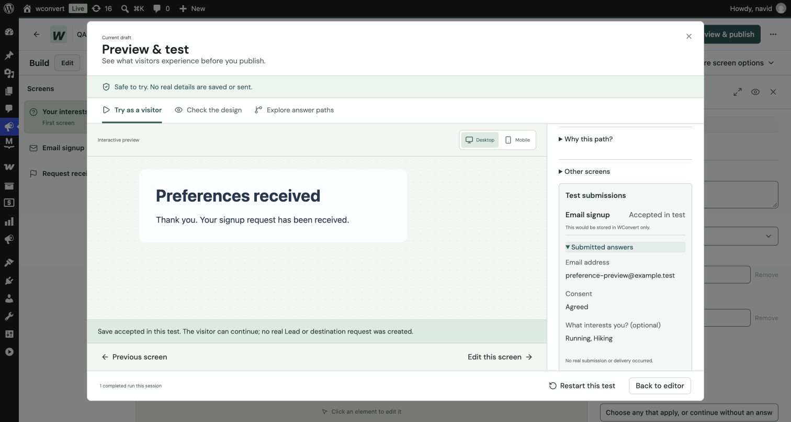
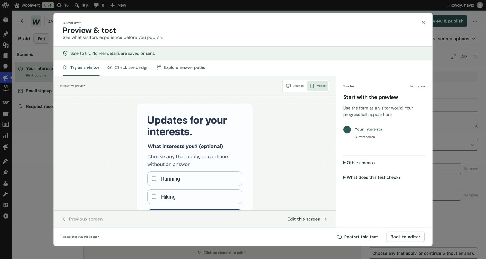

# Shopper preferences with Mailtrap

This records the original joined-text baseline. The subsequent
[separate-interests implementation and verification](separate-interests.md)
adds independent boolean fields while preserving this text-mapping option.

Verified 2026-10-06 against the local WordPress/MySQL site and its saved Mailtrap
connection. The user authorized a sample signup, new/existing-contact tests,
multiple selections, and fixes if those checks exposed a problem. The remote
account belongs to another project, so unrelated data and sending configuration
were outside the test scope.

## Result

The existing implementation passed all 29 live acceptance assertions. No change
to shipping capture, mapping or provider code was necessary for the tested flow.
Added a reusable development fixture and a local-only draft seeder instead of
introducing another preference or mapping feature.

| Scenario | Observed result |
| --- | --- |
| New signup selecting Running | Accepted through the real capture controller, persisted locally, queued, projected by the normal mapping code, and sent by PushWorker. Provider read-back showed `Running` and the dedicated list. |
| Existing test contact, Keep existing details | A later Hiking answer was captured locally; the Mailtrap preference stayed `Running`. |
| Existing test contact, Update mapped fields | Provider read-back changed the preference to `Hiking`. |
| Running and Hiking selected | The provider text field contained `Running; Hiking`. |
| Existing contact skips the optional question | Its previously saved `Hiking` value was preserved. |
| New signup without a preference | The contact was created without the mapped preference field. |
| Replay of an accepted submission | Returned the same Lead with replay acknowledgement; no second capture. |
| Invented choice / missing consent | Refused before delivery. |

Six accepted capture journeys exercised three uniquely named fictional addresses.
The runner checked actual Action Scheduler job registration, unscheduled only
those exact fixture jobs, then called the normal PushWorker with their arguments.
This proves the worker path and queue handoff, not unattended cron execution.
Read-back waited for Mailtrap's asynchronous writes to settle.

## Shared-account controls and cleanup

- Read the Mailtrap Automations page in the signed-in browser: no automations
  existed. The saved token's single account ID matched that browser account.
- Recorded existing list/field definitions, then created one uniquely named QA
  list and one uniquely named text field. The original Newsletter list and name
  fields were not used for test writes.
- Checked all three generated `@example.com` addresses returned 404 before use.
  Existing-contact scenarios reused only a contact created by this run.
- The test process blocked WordPress mail and all HTTP outside allowlisted
  Mailtrap paths, fixture addresses, fixture field and fixture list IDs.
  Credentials stayed in process memory and were not put in the fixture or report.
- Deleted the three created contacts, temporary list and temporary field.
  Subsequent contact reads returned 404; list and field inventories exactly
  matched the baseline. No send endpoint, campaign, automation, domain or
  credential settings were changed.
- Unpublished the local QA campaign, switched its working draft to Collect only,
  cleared its remote bindings/mapping, and removed the temporary local Destination.
  The saved connection and other destinations were left unchanged. The six local
  QA Leads remain attached to the named QA campaign as test evidence.

## Browser verification and review sample

The saved local sample is **QA — Shopper preferences (Running / Hiking)**,
campaign `01M48FXR8T45CTFF0D4KFJZ8F1`:
[open editor](http://wconvert.local/wp-admin/admin.php?page=wconvert#optins?edit=01M48FXR8T45CTFF0D4KFJZ8F1).

In Preview & test, both choices survived Next and Back. A simulated email signup
with consent reached acknowledgement and displayed both submitted interests.
The preview explicitly confirmed that no real Lead or destination request was
created. The mobile-width preview was inspected as well.

## Limits

This confirms preference collection and delivery to a text field. Multiple
selections remain joined text, not native tags or a typed list. No email/SMS was
sent, no audience segment was configured, and no downstream automation was tested.
Rapid independent submissions before Mailtrap applies the first write remain the
previously documented adapter limitation; this run waited for settled writes.
Anonymous survey storage/reporting remains separate future work.

The earlier isolated adapter run passed 13 PHPUnit tests with 225 assertions.
Those mocked tests and the simulated UI preview are separate from the live
provider evidence in this record.
