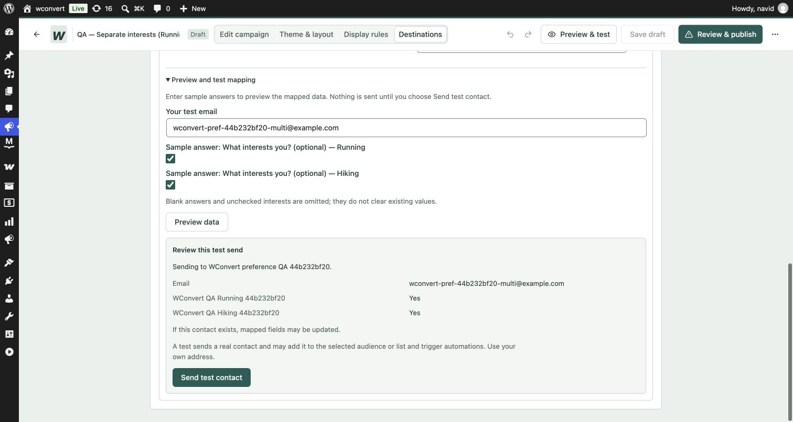

# Separate interests through existing field mapping

Implemented and verified locally on 2026-10-06 after the user selected separate
interests and explicitly chose to keep earlier interests on repeat signups.
This extends the joined-text flow recorded in [the initial review](README.md).

## Behavior

Each option of a multiple-choice question can map to its own existing Mailtrap
boolean field. Running + Hiking sends two literal `true` values. A later Hiking
answer sends only Hiking; it does not send Running=false. Skipped questions and
empty selections send neither field. Existing contacts require **Update mapped
fields**; **Keep existing details** remains the default. Whole-question text
mapping still joins the accepted labels and is unchanged.

Choice mappings use stable option values, are frozen with the accepted
submission, and remain scoped to that submission and Destination. The builder
offers boolean targets only for separate choices. Preview uses checkboxes and
shows Yes for selected interests. The server validates target types before test
and queued sends. Unsupported/removed targets require repair rather than a
silent conversion to text.

Mailtrap's [field API](https://docs.mailtrap.io/developers/email-marketing/contacts/contact-fields/create-contact-field)
documents boolean fields and a maximum of 40 contact fields. This implementation
uses those fields; it does not add provider tags, automatic field creation,
segments, campaigns or sending automations. Other adapters retain their existing
text mapping behavior.

## Live acceptance evidence

29 assertions passed through the real WordPress capture controller, persisted
submission, actual queue registration, normal PushSubject projection and
PushWorker, followed by Mailtrap API read-back:

| Case | Read-back |
| --- | --- |
| New contact selects Running | Running=true; Hiking absent; temporary list joined. |
| Existing fixture selects Hiking with Keep | Running=true; Hiking still absent. |
| Same fixture selects Hiking with Update | Running=true and Hiking=true. |
| New contact selects both | Two independent boolean true fields. |
| Existing fixture skips the question | Both prior interests retained. |
| New contact skips the question | Neither interest field sent. |
| Submission replay | Same Lead returned without another capture. |
| Unknown choice or missing consent | Rejected before delivery. |

Only three uniquely named fictional contacts, two temporary boolean fields and
one temporary list were written. The signed-in Automations screen was checked
before writes and contained no automations. The runtime blocked WordPress mail
and HTTP outside the allowlisted fixture paths and values. No emails were sent.
Original contacts, lists, fields and account settings were not edited.

All three contacts, both fields and the list were deleted after testing. Field
and list inventories exactly matched the baseline. The temporary local
Destination was removed; the QA campaign was unpublished and returned to
Collect only with no remote bindings. Six local QA Leads remain as evidence.
Credentials were read from the saved Connection in memory and never written to
the fixture, logs or this report.

The local QA campaign is `01M48H2N22VPRMACPDMZXMK9K0`, named
**QA — Separate interests (Running / Hiking)**. Its mappings were removed during
cleanup, so the screenshot below records the verified setup before cleanup.

## Automated checks and limits

- PHP capture projection, mapping validation, provider payload and policy tests.
- REST preview/test rejects incompatible types and duplicate targets; unchecked
  interests are omitted. A queued send is refused if its boolean target becomes text.
- 10 integration UI tests passed, including compatible target filtering,
  independent interest samples and repair after a type change.
- TypeScript typecheck, PHPStan and ESLint on changed TypeScript files passed.
- Free and Pro admin builds passed (existing bundle-size/dynamic-import warnings).

Live tests unscheduled only their exact queued fixture jobs before invoking the
worker directly. They prove queue registration and worker behavior, not cron
execution. Writes were allowed to settle between repeat signups; Mailtrap's
previously documented rapid-repeat write limitation remains. Segment filtering
and downstream email/SMS sending were not configured or tested.
