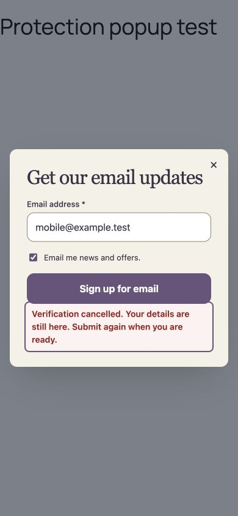

# Spam protection verification — 29 September 2026

The implementation was exercised in a disposable WordPress installation backed
by a separate MySQL database, with both plugins activated. No existing site
content, real provider account, external destination or recipient was used.

## Runtime evidence

`bin/verify-spam-protection.php` passed 24 checks against WordPress REST and real
transactions: administrator-only settings, key secrecy, honeypot rejection,
mandatory verification for each provider, rejection of older unprotected grants,
rejection of bad tokens, accepted capture with idempotent replay, Pro rules and
exceptions, and recipient/resource send suppression.

A separate two-process PHP test raced the same recipient/resource through the
real database: exactly one mail callback ran; the other result was Skipped.
This proves serialization in the test, not exactly-once delivery after crashes.

Playwright Chromium exercised the built assets at 1360×1000 and 390×844:

- Settings loaded the saved provider and blank secret field.
- Test saved setup completed through the isolated frame and WordPress REST,
  without creating a Lead or handing anything to a Destination.
- A published popup requested verification, then accepted the visitor's capture.
- Mobile cancellation preserved the entered email, and retry completed capture.
- Both browser runs reported zero JavaScript page errors.
- After merging campaign events, the protected flow emitted exactly one public
  capture event after verification and server acceptance on desktop and mobile.

The browser widget and Siteverify responses were simulated. These checks do
not establish live provider availability, production keys, real challenge
solvability, or accessibility of the vendors' own widgets. Production enablement
requires the merchant's saved-setup test on the registered hostname.

## Automated and packaging checks

- PHP: 2,345 tests and 14,002 assertions passed, including protection and
  uninstall regressions.
- JavaScript: all 3,434 tests passed. Three unrelated editor tests initially hit the default
  five-second timeout under concurrent tool load, then all 165 tests in those
  files passed serially. The full suite was rerun with two workers.
- TypeScript, ESLint, PHPStan, source contract and whitespace checks.
- Full Vite build and loader/phone checks for all four tiers (the measured 256-byte loader
  amendment after merging campaign events is documented in ADR 0111).
- Free plus Basic, Pro and Elite release ZIPs built; all artifact contracts passed.

## Provider contracts used

- [Turnstile server verification](https://developers.cloudflare.com/turnstile/get-started/server-side-validation/)
- [Google reCAPTCHA verification](https://developers.google.com/recaptcha/docs/verify)
- [hCaptcha verification](https://docs.hcaptcha.com/#verify-the-user-response-server-side):
  the configured sitekey is sent for verification; the informational hostname
  can be `not-provided` under load and is not an authentication check.

## Validation and polish follow-up

A separate disposable WordPress/MySQL site on port 9438 preserved the user-facing
9437 demo's settings. Built assets were exercised through the in-app Chromium
browser at 1280×720 and 390×844.

- Representative email-then-SMS journeys accepted protected captures in popup,
  inline, fullscreen, floating-bar and slide-in containers. This covers the
  shared containers and capture flow, not every library design/vendor combination.
- Desktop Escape and mobile Cancel preserved email and consent, displayed the
  specific cancellation message and focused it. Mobile keyboard-only retry
  advanced to the optional SMS screen.
- A real published content-lock shortcode exposed a classification bug: browser
  cancellation had been treated as an uncertain capture and revealed content.
  The corrected Free/Pro classification keeps verification refusals correctable.
  A fresh browser run confirmed cancellation kept the bonus hidden and retry
  revealed it only after server acceptance.
- Admin saved-setup verification passed; focus returned to the test button.
  Editing the site key removed the old success message and disabled testing
  until saved. The page displayed the configured hostname and a blank secret.
- The controlled flows used a clearly labelled simulated widget and simulated
  Siteverify responses; no recipient mail or destination was configured. No
  browser console errors were reported in the completed flow checks.

The optional dialog now uses a compact Turnstile size, bounded provider frame
sizes, loading text, theme-resistant styling, and clear cancellation/failure
messages. Settings distinguish Testing from Saving and avoid stale success.

Separately, live HTTP requests through the actual PHP Verifier (with all test
HTTP interception removed) accepted hCaptcha's documented public test token
and rejected an invalid token. Turnstile's public dummy response returned
`example.com` and no capture action, and was correctly rejected by the strict
binding checks. No production bypass was added. The public Turnstile browser
script loaded but did not complete its widget in this test environment; no live
end-to-end CAPTCHA pass is claimed. Google production verification and actual
vendor challenge usability remain merchant-key checks on the registered host.

Final local checks: 2,345 PHP tests / 14,002 assertions; 3,442 JavaScript tests;
TypeScript, ESLint, PHPStan, source contract, full build, four release artifact
contracts and loader/phone budgets. The new journey regressions exercise both
Free and Pro in inline and popup containers: cancelled input/focus, correctable
classification, retry, one verification for the accepted email/SMS journey, and
one capture callback. Final gzip-9 loader sizes: 14,479 / 24,983 / 26,557 / 26,808
bytes for Free / Basic / Pro / Elite, within the existing limits.

