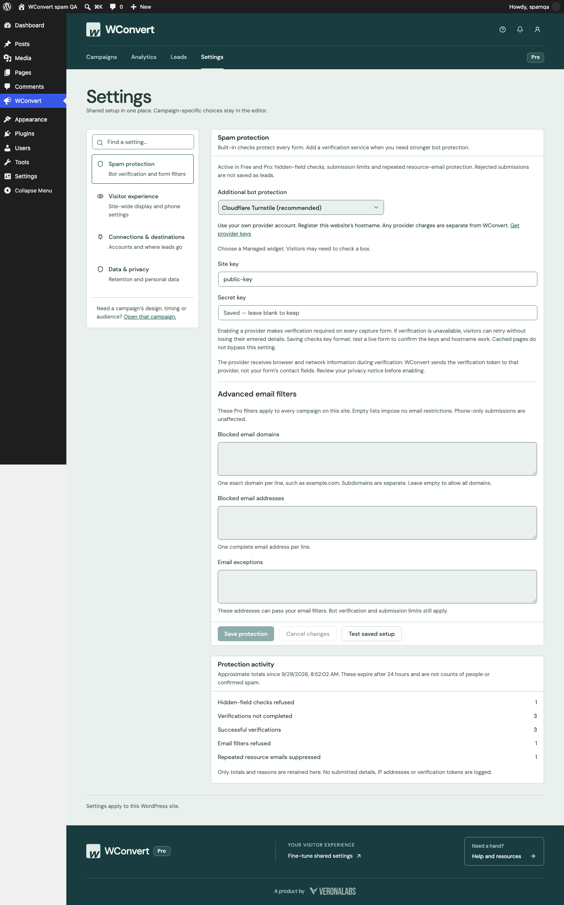
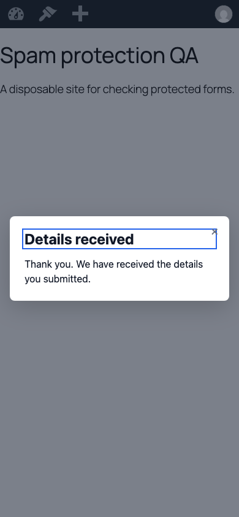

# Spam protection verification — 29 September 2026

The implementation was exercised in a disposable WordPress installation backed
by a separate MySQL database, with both plugins activated. No existing site
content, real provider account, external destination or recipient was used.

## Runtime evidence

`bin/verify-spam-protection.php` passed 24 checks against WordPress REST and real
transactions: administrator-only settings, key secrecy, honeypot rejection,
mandatory verification for each provider, rejection of older unprotected grants,
rejection of bad tokens, accepted capture with idempotent replay, Pro rules and
exceptions, and recipient/resource send suppression.

A separate two-process PHP test raced the same recipient/resource through the
real database: exactly one mail callback ran; the other result was Skipped.
This proves serialization in the test, not exactly-once delivery after crashes.

Playwright Chromium exercised the built assets at 1360×1000 and 390×844:

- Settings loaded the saved provider and blank secret field.
- Test saved setup completed through the isolated frame and WordPress REST,
  without creating a Lead or handing anything to a Destination.
- A published popup requested verification, then accepted the visitor's capture.
- Mobile cancellation preserved the entered email, and retry completed capture.
- Both browser runs reported zero JavaScript page errors.

The browser widget and Siteverify responses were simulated. These checks do
not establish live provider availability, production keys, real challenge
solvability, or accessibility of the vendors' own widgets. Production enablement
requires the merchant's saved-setup test on the registered hostname.

## Automated and packaging checks

- PHP: 2,345 tests and 13,995 assertions passed, including protection and
  uninstall regressions.
- JavaScript: all 3,415 tests passed. Three unrelated editor tests initially hit the default
  five-second timeout under concurrent tool load, then all 165 tests in those
  files passed serially. The full suite was rerun with two workers.
- TypeScript, ESLint, PHPStan, source contract and whitespace checks.
- Full Vite build and unchanged loader/phone byte ceilings for all four tiers.
- Free plus Basic, Pro and Elite release ZIPs built; all artifact contracts passed.

## Provider contracts used

- [Turnstile server verification](https://developers.cloudflare.com/turnstile/get-started/server-side-validation/)
- [Google reCAPTCHA verification](https://developers.google.com/recaptcha/docs/verify)
- [hCaptcha verification](https://docs.hcaptcha.com/#verify-the-user-response-server-side):
  the configured sitekey is sent for verification; the informational hostname
  can be `not-provided` under load and is not an authentication check.
