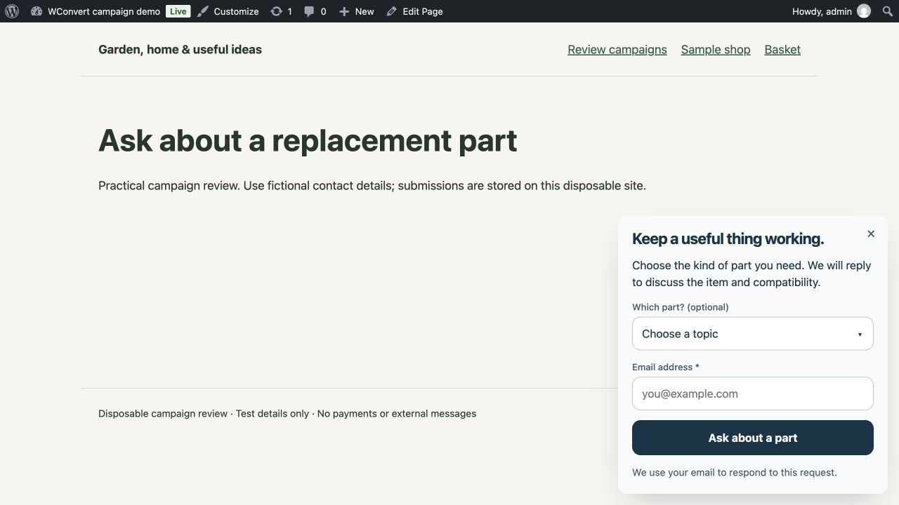
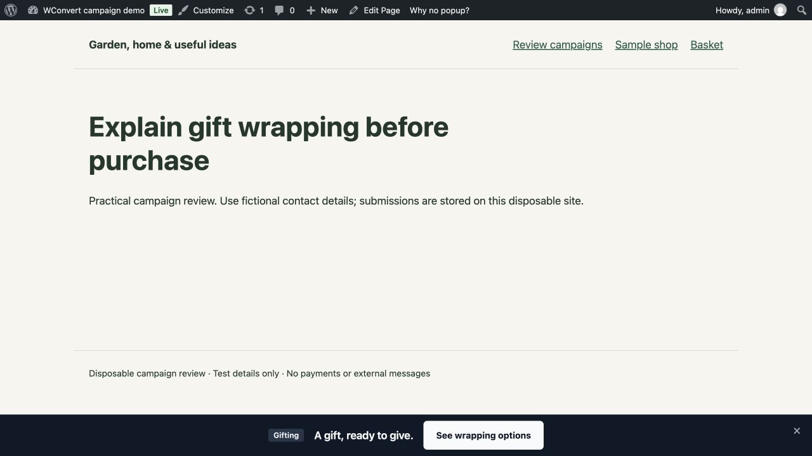

# Contextual-help batch and maintenance review

The library now contains **96 campaign setups using 47 designs**, across a full
inventory of 79 designs and 121 registered Playbooks. This batch adds 24 setups:
eight floating bars, eight slide-ins, six popups and two inline checklists. Eleven
serve stores, ten serve service businesses and three serve publishers.

Only one new design is introduced: `slide-in-question`, a compact enquiry with
an optional category choice and required email. The other setups deliberately
reuse designs. `bar-email-capture` and `journey-offer-first` enter the curated
collection for the first time. New copy and follow-up requirements do not count as
new visual designs. The collection covers 45 store, 35 service and 16 publisher
setups, all seven Goals and all five Display Types.

## Maintenance

The studio's dependency view lists all registered Playbooks for each design,
including those outside the curated collection. Source hashes and numbered,
dated version notes reveal unrecorded changes. The local gate rejects those
changes independently of campaign approval. The record command appends history
without approving or publishing anything. Retirement requires a reason and an
active replacement, rejects cycles and affects internal discovery only. No design
is retired, no customer draft is rewritten, and customer update notifications or
catalog deprecation are not implemented by this work.

Advisory inspection identifies empty copy, icons without companion content and
benefit rows that could wrap unevenly. Two genuine omissions were corrected:
`accounting-consultation` now supplies the acknowledgement eyebrow, and
`project-readiness-guide` supplies the heading/body beside its form. Site-owned
wordmarks are intentionally cleared by Prefill and are not treated as missing
campaign copy. The two remaining benefit-row prompts (`restyling-notes` and
`editorial-weekly`) were inspected in both directions; no overflow was observed.
These prompts remain visible for human judgement and are not automatic failures.

See [the maintenance guide](../../tools/design-library/MAINTENANCE.md) for changes,
retirement and the saved-campaign boundary.

## Problems caught during review

- The signup bars' subordinate heading level made button text overpower the
  headline in 16 layout cases. Both bar headings now use the normal heading scale.
  The unrelated gift icon was removed; field/consent IDs are unchanged.
- The native popover inherited the browser's `inset: 0`. A default slide-in had
  top/left zero and stretched to 704px tall while its card occupied the top left.
  Explicitly resetting the inset to `auto` before applying logical edges fixes
  both bars and slide-ins. The real slide-in now measures x=880, y=307.359,
  width=384, height=396.641 on the 1280×720 review viewport: 16px from the right
  and bottom. The same live form successfully captured a fictional enquiry and
  displayed its acknowledgement. The bottom announcement bar was also checked.
  A regression test failed with the browser's zero-inset baseline before the fix
  and passed afterward. jsdom cannot prove placement geometry; the browser result
  supplies that separate evidence. Existing tests cover configured logical edges.

## Visual and practical checks

- All **43 screens** in the new batch were inspected at 768px available desktop
  width and 320px phone width, LTR and RTL, using the shipping renderer. The two
  corrected older setups and two comparison-only neighbours were inspected too.
  Extra checks of the two remaining editorial prompts bring the local capture
  manifest to 110 paired screenshots (55 screens in two directions).
- The final whole-library browser audit checks **1,616 screen/result/width/direction
  cases with zero findings**, at 320, 390, 768 and 1440px. This tests geometry,
  control sizes and bar hierarchy; human inspection covers typography and spacing.
- All 18 new capture flows reject missing email, retain entered details after a
  simulated failure, and reach the acknowledgement after retry. The maker-session
  introduction advances to signup and its “Maybe later” path dismisses it. The
  two corrected older forms were exercised through failure and retry as well.
- Six real information bars were followed by keyboard to matching fictional
  wrapping, dispatch, showroom, holiday-hours, remote-consultation and contributor
  guidance pages. Useful venue-hire and contributor-pitch checklist pages were
  added. Guidance distinguishes dispatch from delivery and enquiry from booking,
  order, account approval or reserved availability.
- The actual WordPress goal-first flow shows the new enquiry cards beside their
  neighbours, with Stores + Slide-in narrowing to four appropriate setups. Setup
  details explain the follow-up and placement. No extra campaign was published
  through that picker review.
- The disposable WordPress/MySQL verifier passes **all 96 campaigns**. It checks
  publication, required fields, saved email/phone/preferences, retry idempotency,
  real link destinations and each result branch. Every one of the ten resource
  setups hands off one local email with a useful content URL. No email or SMS
  reaches an external provider or recipient.

## Local verification

- PHP: 2,280 tests, 13,418 assertions.
- JavaScript: 3,350 tests across 180 files, including the popover regression.
- Internal studio: 15 tests.
- PHPStan, TypeScript, ESLint, template validation (79 definitions) and source
  contract pass. Pro loaders were rebuilt and inspected on the real demo.
- No CI run, release, merge or external delivery test was requested or performed.

The paired JSON pins reviewed revisions, source hashes, local capture hashes,
flow observations and the native verification report. Retained representative
screenshots are in `contextual-help-2026-09-28/`; full captures remain in ignored
`tools/design-library/out/contextual-review/` and can be recreated from the proofs.

`gift-planning-guide` and `fitness-introduction` changed review revision only
because adding a design changed their nearest-comparison metadata. Their copy,
tree and capture paths are unchanged; current visual inspection and the rerun
native verifier supplement their existing journey evidence.

These are editorially reviewed candidates, not measured conversion winners or a
release approval. The new paid design has no hosted public marketing preview yet;
its Free-tier card remains informational, consistent with existing unpaid preview
handling. Merchant branding, page targeting, destinations and real offers still
require site-specific setup. Cross-browser/physical-device certification,
translation review and external delivery remain outside this review.
