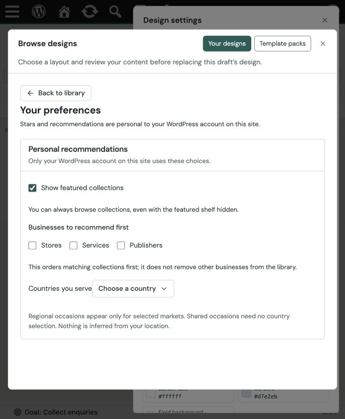

# Local template publishing foundation — 1 October 2026

This review covers the first usable local schema-2 publisher and the isolated
media/authorization foundations. It is not approval for a hosted service or for
all remaining items in the picker programme. The user explicitly deferred the
real licence-manager integration. No CI, cloud deployment, merge or real provider
delivery was performed.

## Release evidence

Command: `npm run templates:release:local`, directory
`/tmp/wconvert-template-release-local`, metadata origin `https://templates.example`.
No request is sent to that example origin. Output is disposable and reproducible;
use backed-up storage outside a web document root for retained releases.

Release identity:
`5b268a7b715b35b4dbb1474cc4ddd4e15513d323f9e270ce6f0a2d9000dd585b`.

- 13 approved setups, 10 distinct designs, 3 Free delivery packs, 2 collections.
- The first publication created five immutable objects: three packs, one page,
  one retained manifest. A repeated publication created zero and reused all five.
- Renderer/setup revisions were rebuilt; the shared review store and collection
  source hashes were rechecked. Existing review records were not changed.
- The actual PHP reader validated the whole release and every pack before writes.
- `sale-deadline`, `lighting-collection` and `homeware-care-notes` remain explicitly
  deferred in the publishing plan. Their existing site link/SVG content was not
  removed or weakened to pass the media-free import contract.

`bin/verify-template-release.php` booted the actual `wconvert.local` WordPress
installation through its Local MySQL socket. It used in-memory options, file
transport and a temporary archive, then removed that archive. Native preview and
install passed for all three packs. Installed previews matched inspected bytes;
offline reads retained 10 designs, 13 setups and 2 collections. WordPress 7.1 /
CLI PHP 8.5.8. No site options, real installed archive, campaigns or Leads changed.
This proves native reader compatibility, not HTTPS/R2/licence delivery.

## Failure and regression checks

- 28 internal studio tests passed, including seven new publisher/download tests:
  immutable reuse, access separation, interrupted publication/retry, stale expected
  release, concurrent lock, corruption, missing references, version discipline,
  expired/revoked/wrong-plan/wrong-site/outage decisions, request-bound allowance,
  withdrawn resources, cache headers and downloaded-byte integrity.
- 635 PHP Template tests / 2,608 assertions passed. New media checks cover stable
  local URLs, scoped reuse, partial failure without a package marker, retry,
  corruption repair, type/dimension/byte limits and unsupported URL/SVG fields.
- An actual export discovered a screen-scoped wording bug in PackPlaybooks.
  The validator now shares SlotRoles' scope mapping and validates each screen's
  own bindings. A regression proves valid wording survives and unsafe wording is
  refused. The existing remote-data restrictions remain intact.
- 116 affected React tests passed across preferences, editor gallery, packs and
  goal-first creation. Existing builder-gallery tests emit async `act` warnings;
  there were no test failures.
- TypeScript, ESLint, full PHPStan and the Free source contract passed. Free and
  Pro admin bundles rebuilt successfully. No renderer source was changed.

## Actual admin inspection

On `wconvert.local`, opened the existing QA service-enquiry draft, Theme & layout,
Design settings, Browse designs and My preferences. Confirmed the shared modal
shows personal recommendations and countries, with no site-occasion form or
shared-date explanation. The header and Back control fit the current narrow
window. Closing restored focus, and Save draft remained disabled. Returned to
Campaigns without changing the draft. Creation retains occasion management,
covered by the existing goal/settings tests.

## Explicit remaining work

The media installer is a tested primitive, **not connected to pack installation**.
Pack schema 1 still requires empty assets; reference rewriting, publisher rights
records, bounded authorized HTTP transport, SVG policy and complete pack/media
commit integration remain. The host-neutral download function has no HTTP route,
credentials or production authorizer. Real licence-manager integration is deferred
at the user's request. Website public previews, live plugin online previews,
custom-occasion stage curation, retention/cleanup, complete studio simulations and
500-setup/accessibility programme checks remain separate work. R2/Worker and a
production template endpoint have not been provisioned.
