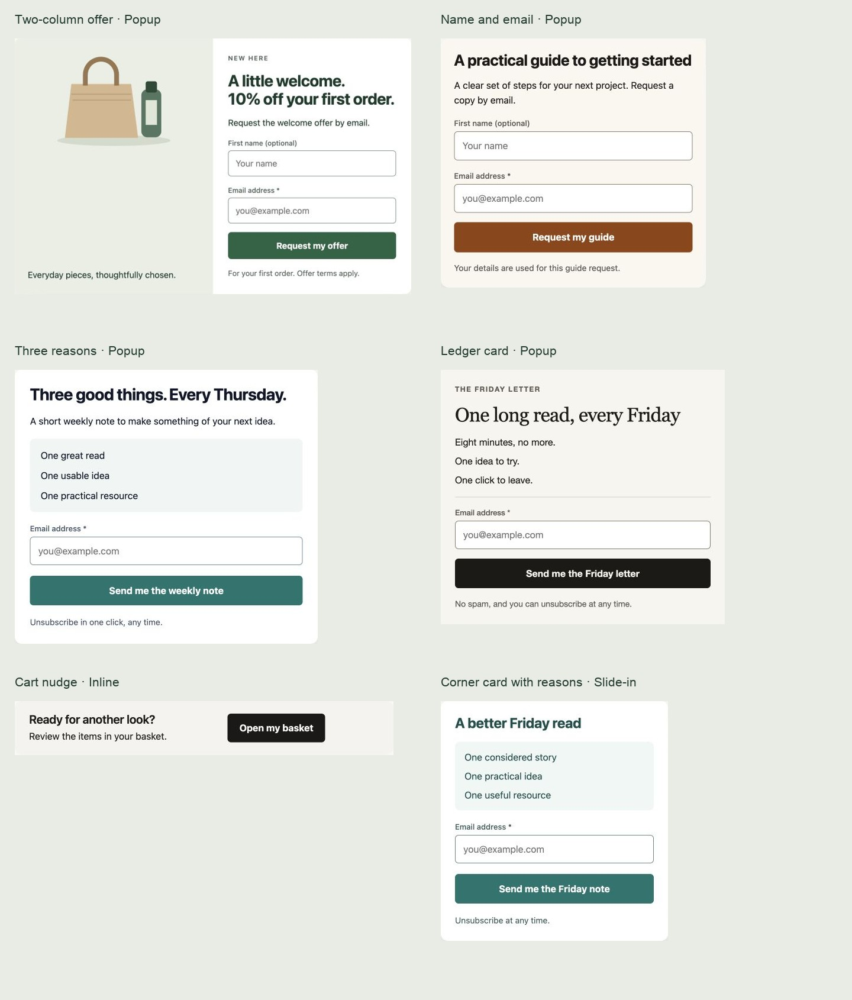

# Six template refinements

Reviewed 29 September 2026. Six existing source designs were refined in response to the supplied screenshots. Counts remain 91 registered designs, 133 registered Playbooks and 108 curated campaign setups using 59 designs. No design was retired, no customer snapshot was migrated, and no runtime capture or rendering code changed.

## Changes

| Source | Type | Result |
| --- | --- | --- |
| Two-column offer | Popup | Original tote/bottle artwork replaces the abstract placeholder. Balanced split panels, clearer hierarchy, optional name and a compact mobile form. |
| Name and email | Popup | Quieter warm surface, darker labels and field outlines, smaller heading, restrained corners and one-guide request wording. |
| Three reasons | Popup | A single readable benefit panel replaces inconsistently wrapping icon columns. Left alignment and a clear form hierarchy. |
| Ledger card | Popup | A consistent text list replaces decorative icons. Visible email label and full-width action preserve the editorial treatment. |
| Cart nudge | Inline | Removes the unrelated delivery truck. A message/action split wraps predictably on phones. Free locked-card shape metadata matches the actual split. |
| Corner card with reasons | Slide-in | Removes unrelated symbols, groups the three benefits in a compact panel, strengthens the field boundary and adds unsubscribe guidance. |

All retained field and submission IDs remain stable. Each source now has a recorded version 2. Four former improvement recommendations are now keep decisions; the two existing consolidation candidates remain candidates pending a separate dependency-aware decision. Current advisory totals are 74 keep, 11 improve and 6 consolidation candidates.

## Contrast and checker correction

The guide and corner card's pale field outlines were insufficient against their adjacent surfaces. Their smallest measured outline ratios, comparing both the inner fill and surrounding surface, changed as follows:

| Source | Before | After |
| --- | ---: | ---: |
| Name and email | 1.20:1 | 3.58:1 |
| Corner card with reasons | 1.13:1 | 3.98:1 |

The target for a necessary control boundary is 3:1, following [WCAG non-text contrast](https://www.w3.org/WAI/WCAG22/Understanding/non-text-contrast.html). Text is measured separately at 4.5:1 for ordinary text or 3:1 for large text, following [WCAG contrast minimum](https://www.w3.org/WAI/WCAG22/Understanding/contrast-minimum.html). All measured solid-colour text/field pairs in these six sources and their six dependent setups pass those applicable thresholds. This is scoped contrast evidence, not full accessibility certification.

The review harness had two gaps: its longer-copy traversal missed `step.content`, and the shipping renderer's fully transparent gradient overlay caused background lookup to skip most text. Both are corrected. Typed input text, placeholders and inset field boundaries are now measured explicitly. Opaque images/gradients and translucent backgrounds remain outside automated contrast measurement and require visual inspection. Switching between versions clears the previous results.

The identical corrected audit flags 80 cases in the six original designs and zero in the revised six. The original full-inventory report has been annotated: its old zero-finding result does not establish comprehensive contrast or longer-copy coverage. The other 85 sources have not received a fresh corrected contrast audit in this pass.

## Render and practical checks

- 176 revised source cases: all 11 authored screens, 320/390/768/1440 widths, LTR/RTL, normal and extended copy with consent shown. Zero overflow, undersized controls, small input text or measured contrast failures.
- 176 dependent setup cases: the same matrix for `restyling-notes`, `editorial-weekly`, `gift-planning-guide`, `cart-delivery-help`, `checklist-download` and `consultation-invitation`. Zero findings.
- All source screens manually inspected at 320 and 768, plus 320 RTL. All six prepared setups and their acknowledgements inspected at 768 and 320 RTL; the initial 320 overview and focused longer-copy guide were also inspected. RTL uses the existing English copy and tests direction/geometry, not translation quality.
- 108 existing disposable WordPress campaign checks passed, including required-field validation, capture, replay, saved values and configured destinations/resource handoffs. The affected four curated campaigns were refreshed only in the disposable demonstration database.
- Two additional disposable fixtures exercised the source-only two-column popup and corner slide-in with campaign-specific consent configured. At a real 320 × 740 browser viewport, keyboard navigation scrolled the taller popup's action into view; optional name was left blank and submission reached the acknowledgement. The corner card rejected missing consent, then accepted the fictional signup and reached its acknowledgement. Focus outlines and acknowledgement focus were visibly present. The screenshot at the missing-consent step preserves the actual browser validation message.
- No external email/SMS was sent. The existing intercepted local outbox remained in use. No CI was run.

Evidence: [source matrix](template-six-refinements-2026-09-29/source-layout.json), [original matrix](template-six-refinements-2026-09-29/baseline-layout.json), [dependent matrix](template-six-refinements-2026-09-29/dependent-layout.json), [native checks](template-six-refinements-2026-09-29/native-checks.json), and adjacent viewport screenshots.

## Review invalidation and validation

Four curated campaigns have changed rendered content/configuration and receive fresh evidence-backed reviews. Another 32 have changed only their nearest-design comparison metadata and resulting review hash. A field-by-field comparison confirms their campaign configuration, tree, tokens and remaining payload are unchanged; their previous stage evidence is retained alongside this report. See [the comparison](template-six-refinements-2026-09-29/campaign-diff.json). No previous review history is overwritten.

Local checks passed: 91 template definitions, 2,328 PHP tests (13,867 assertions), 3,387 JavaScript tests in 180 files, 17 studio tests and the source contract. The two-column and corner fixtures are local review data; no new templates or Playbooks were added. Existing customer campaigns keep their saved designs. Merchant offer terms, content, artwork and delivery configuration still require site-specific setup; no conversion-lift claim is made.
