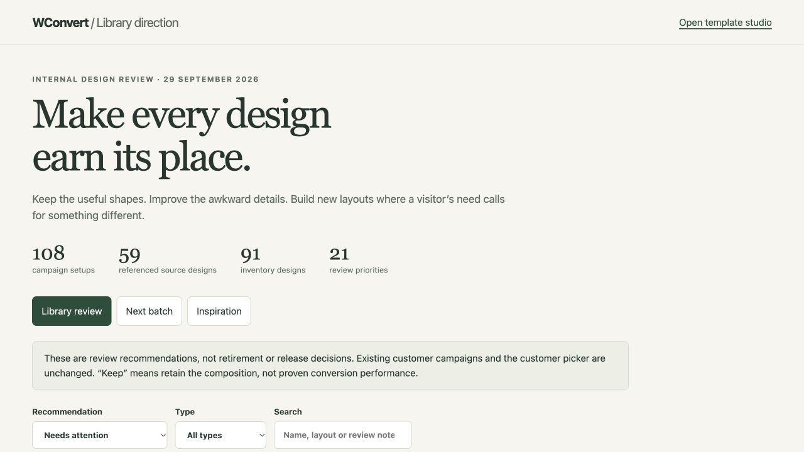

# Full-inventory visual audit and next-batch reference board

Reviewed 29 September 2026. The deliverable is an internal comparison board and a revision-bound advisory audit, not a new shipping template batch.

## Outcome

The library still contains **108 prepared campaigns using 59 source designs**. The complete inventory contains **91 designs and 133 registered Playbooks**. All 91 compositions were reviewed, including the 12 recent additions.

| Recommendation | Designs | Meaning |
| --- | ---: | --- |
| Keep | 70 | Retain the composition; not a claim of measured conversion performance. |
| Improve | 15 | Preserve its purpose while fixing the specific UI or sample-content issue. |
| Compare for consolidation | 6 | Investigate overlap and dependencies before any retirement decision. |

No design was retired or changed in this pass. No customer availability, saved campaign snapshot or shipping renderer changed. Existing campaign approvals were not regenerated merely to attach this advisory review.

Run `npm run templates:pilot` and open `tools/design-library/out/roadmap.html`. The board includes type and tier labels, actual source previews, source-versus-prepared-copy selection, all authored screen selectors, viewport/RTL controls, explicit comparators and dependencies across all registered Playbooks. Links open the exact prepared campaign in the studio. Board previews are inert; the studio remains the place to test interactions.

The audit records each source revision and the shared renderer revision. Changed or newly added sources display “Needs a fresh review” rather than inheriting a keep decision. This advisory state is separate from approval and retirement metadata.

## Cleanup before expansion

Seven priority-one improvements were identified:

| Design | Finding | Required action |
| --- | --- | --- |
| `benefit-grid` | Benefit icons wrap inconsistently across the desktop columns. | Establish one consistent icon/text alignment and check long copy. |
| `ledger-card` | The first benefit's clock wraps above its text while neighbouring icons remain inline. | Make the three rows use a predictable layout. |
| `slide-in-benefits` | Delivery-truck artwork accompanies a reading benefit. | Remove irrelevant symbols or use a meaningful content treatment. |
| `slide-in-nudge` | A lightning icon does not explain the informational action. | Remove it and rebalance the compact card. |
| `inline-cart-nudge` | A truck is shown for a generic basket reminder. | Use a clear message/action arrangement without an unrelated icon. |
| `inline-split` | The one-guide sample retains marketing-consent wording. | Align the sample's permission and acknowledgement with the actual request. |
| `slide-in-photo` | A tall plant illustration is unrelated to the bakery sample. | Use relevant artwork or an intentional text-only fallback; reduce mobile height. |

Eight further improvements cover fullscreen mobile density, long acknowledgement/content layouts, placeholder proof, product-image relevance and sample policy claims. Exact notes and comparators are in `tools/design-library/review/visual-audit.json`.

Consolidation candidates are `popup-flash`, `popup-two-column`, `inline-quiet`, `number-invitation`, `journey-email-only` and `name-and-email`. Structural resemblance alone does not establish duplication. Before any retirement, compare practical flows and all dependent Playbooks, preserve field/action contracts, account for Free/paid packaging, identify an active replacement and verify saved campaigns remain intact. None of these decisions has been executed.

## Proposed batch

The board places six original sketches beside existing rendered designs:

1. A specification matrix for comparing two products — popup.
2. A compact phone callback slip — slide-in, using the existing phone library when authored.
3. A readable workbook excerpt beside a request form — inline.
4. A date-led event information card — popup.
5. A small product portrait beside useful facts — popup.
6. An ordered service process above a compact enquiry footer — inline.

Two additional campaign briefs intentionally reuse Availability note for arrival/access information and Inline signpost for current returns-policy information. All eight remain **planned**, with practical acceptance checks. Sketches are not working templates, are not counted as new source designs and have no conversion evidence. Priority-one cleanup precedes registration of this batch.

The Inspiration view records the scope of the earlier Depicter review: the [horizontal image signup](https://depicter.com/template/horizontal-signup-form-with-image/10587/) and [Cyber Week notification bar](https://depicter.com/template/early-cyber-week-notification-bar/11002/) had live desktop preview inspection; the [slide-ins](https://depicter.com/templates/#/slide-ins) were reviewed through gallery thumbnails after detail previews stalled. The lessons were a purposeful split image panel, a compact contextual request, and a shallow message/action bar. Official reference-page availability was rechecked this turn, not a new visual/functional inspection. The board uses original explanatory diagrams; no competitor assets, copy or source were imported. Mobile behaviour, form submission and conversion performance of those references were not tested.

## Validation and evidence

- **2,720 rendered cases, zero automated findings:** all 170 authored source screens at 320/390/768/1440, LTR/RTL and normal/longer copy. Checks cover horizontal overflow, minimum 44px controls, minimum 16px input text and solid-colour text contrast. These source checks use default result states; they do not replace the earlier campaign-specific alternate-result checks.
- **32 contact sheets manually inspected:** every source screen at 320 and 768. Phone popup content is narrower than the viewport because of container gutters. `320-1.jpg` through `320-16.jpg` and `768-1.jpg` through `768-16.jpg` preserve those sheets as JPEG proofs. Original PNG captures remain in ignored local build output. Passing geometry checks did not hide the editorial/alignment problems listed above.
- **108 local WordPress campaign checks passed**, including configured captures, retries, saved values, destinations and resource handoffs. The local intercepted outbox remained in use; no external email/SMS delivery was attempted.
- One fresh manual studio walkthrough exercised `restyling-notes`: simulated failure retained the fictional email and consent, and retry reached the truthful request acknowledgement. It explicitly reported that no details were saved or sent. This is not represented as a fresh manual walkthrough of all 108 campaigns.
- **17 studio tests passed**, including stale source/renderer review handling and invalid comparison/reuse rejection. `composer verify:templates` passed for all 91 definitions, `composer verify:source` passed, and the editorial gate remained **108/108 current**.
- Board filters, search/empty state, comparison selection, prepared-copy switching, screen selectors, RTL, Escape dismissal, reference links and exact-campaign studio links were exercised in the browser. All three views fit 320px with no horizontal overflow; 390px and desktop were also checked. No browser console errors were observed.

Evidence lives in [the adjacent folder](template-visual-audit-2026-09-29/), including `report.json` with evidence hashes, complete `layout.json`, native verification, command logs and board screenshots. Board screenshots use individual viewport captures to avoid full-page stitching artefacts.

CI and real delivery remain skipped at the user's request. This is draft review work, with no merge or release. Conversion lift and physical-device/cross-browser certification are not established by these checks.
